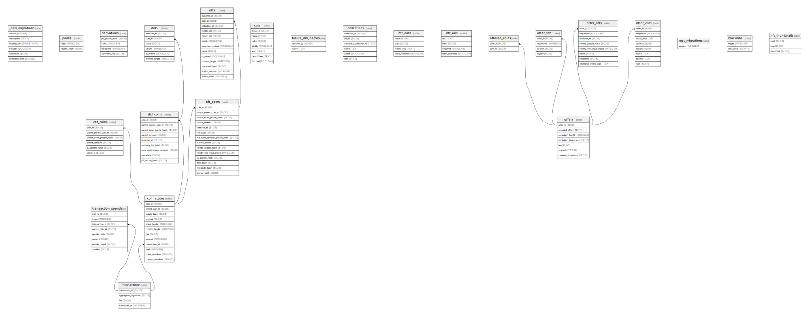

# test.sqlite

## Tables

| Name | Columns | Comment | Type |
| ---- | ------- | ------- | ---- |
| [_sqlx_migrations](_sqlx_migrations.md) | 6 |  | table |
| [peaks](peaks.md) | 2 |  | table |
| [derivations](derivations.md) | 4 |  | table |
| [coin_states](coin_states.md) | 12 |  | table |
| [transactions](transactions.md) | 4 |  | table |
| [transaction_spends](transaction_spends.md) | 8 |  | table |
| [cats](cats.md) | 7 |  | table |
| [cat_coins](cat_coins.md) | 6 |  | table |
| [dids](dids.md) | 6 |  | table |
| [future_did_names](future_did_names.md) | 2 |  | table |
| [did_coins](did_coins.md) | 9 |  | table |
| [collections](collections.md) | 6 |  | table |
| [nfts](nfts.md) | 13 |  | table |
| [nft_coins](nft_coins.md) | 14 |  | table |
| [nft_data](nft_data.md) | 4 |  | table |
| [nft_uris](nft_uris.md) | 4 |  | table |
| [offers](offers.md) | 7 |  | table |
| [offered_coins](offered_coins.md) | 2 |  | table |
| [offer_xch](offer_xch.md) | 4 |  | table |
| [offer_nfts](offer_nfts.md) | 8 |  | table |
| [offer_cats](offer_cats.md) | 8 |  | table |
| [rust_migrations](rust_migrations.md) | 1 |  | table |
| [blockinfo](blockinfo.md) | 2 |  | table |
| [nft_thumbnails](nft_thumbnails.md) | 3 |  | table |

## Relations

---

> Generated by [tbls](https://github.com/k1LoW/tbls)
