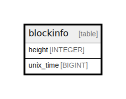

# blockinfo

## Description

<details>
<summary><strong>Table Definition</strong></summary>

```sql
CREATE TABLE `blockinfo` (
    `height` INTEGER NOT NULL PRIMARY KEY,
    `unix_time` BIGINT NOT NULL
)
```

</details>

## Columns

| Name | Type | Default | Nullable | Children | Parents | Comment |
| ---- | ---- | ------- | -------- | -------- | ------- | ------- |
| height | INTEGER |  | false |  |  |  |
| unix_time | BIGINT |  | false |  |  |  |

## Constraints

| Name | Type | Definition |
| ---- | ---- | ---------- |
| height | PRIMARY KEY | PRIMARY KEY (height) |

## Indexes

| Name | Definition |
| ---- | ---------- |
| blockinfo_index | CREATE INDEX `blockinfo_index` ON `blockinfo` (`height`) |

## Relations



---

> Generated by [tbls](https://github.com/k1LoW/tbls)
