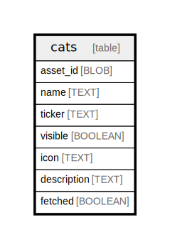

# cats

## Description

<details>
<summary><strong>Table Definition</strong></summary>

```sql
CREATE TABLE `cats` (
    `asset_id` BLOB NOT NULL PRIMARY KEY,
    `name` TEXT,
    `ticker` TEXT,
    `visible` BOOLEAN NOT NULL,
    `icon` TEXT,
    `description` TEXT,
    `fetched` BOOLEAN NOT NULL,
    `is_named` BOOLEAN GENERATED ALWAYS AS (`name` IS NOT NULL) STORED
)
```

</details>

## Columns

| Name | Type | Default | Nullable | Children | Parents | Comment |
| ---- | ---- | ------- | -------- | -------- | ------- | ------- |
| asset_id | BLOB |  | false |  |  |  |
| name | TEXT |  | true |  |  |  |
| ticker | TEXT |  | true |  |  |  |
| visible | BOOLEAN |  | false |  |  |  |
| icon | TEXT |  | true |  |  |  |
| description | TEXT |  | true |  |  |  |
| fetched | BOOLEAN |  | false |  |  |  |

## Constraints

| Name | Type | Definition |
| ---- | ---- | ---------- |
| asset_id | PRIMARY KEY | PRIMARY KEY (asset_id) |
| sqlite_autoindex_cats_1 | PRIMARY KEY | PRIMARY KEY (asset_id) |

## Indexes

| Name | Definition |
| ---- | ---------- |
| cat_name | CREATE INDEX `cat_name` ON `cats` (`visible` DESC, `is_named` DESC, `name` ASC, `asset_id` ASC) |
| cat_lookup | CREATE INDEX `cat_lookup` ON `cats` (`fetched`) |
| sqlite_autoindex_cats_1 | PRIMARY KEY (asset_id) |

## Relations



---

> Generated by [tbls](https://github.com/k1LoW/tbls)
