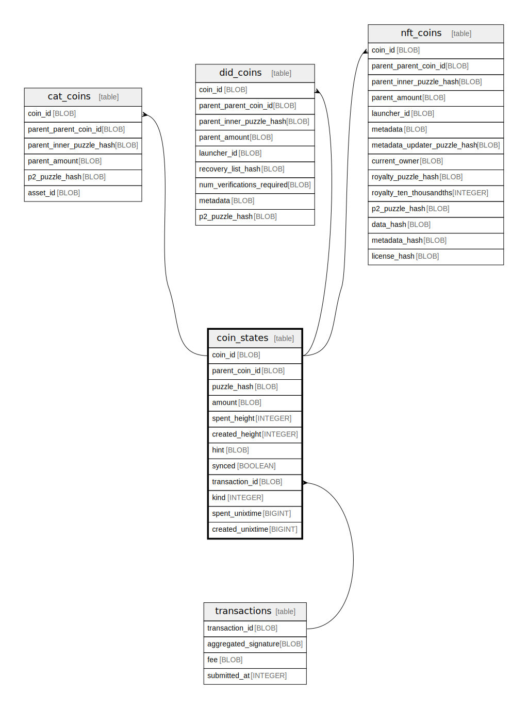

# coin_states

## Description

<details>
<summary><strong>Table Definition</strong></summary>

```sql
CREATE TABLE `coin_states` (
    `coin_id` BLOB NOT NULL PRIMARY KEY,
    `parent_coin_id` BLOB NOT NULL,
    `puzzle_hash` BLOB NOT NULL,
    `amount` BLOB NOT NULL,
    `spent_height` INTEGER,
    `created_height` INTEGER,
    `hint` BLOB,
    `synced` BOOLEAN NOT NULL,
    `transaction_id` BLOB, `kind` INTEGER NOT NULL DEFAULT 0, `spent_unixtime` BIGINT, `created_unixtime` BIGINT,
    FOREIGN KEY (`transaction_id`) REFERENCES `transactions` (`transaction_id`) ON DELETE CASCADE
)
```

</details>

## Columns

| Name | Type | Default | Nullable | Children | Parents | Comment |
| ---- | ---- | ------- | -------- | -------- | ------- | ------- |
| coin_id | BLOB |  | false | [cat_coins](cat_coins.md) [did_coins](did_coins.md) [nft_coins](nft_coins.md) |  |  |
| parent_coin_id | BLOB |  | false |  |  |  |
| puzzle_hash | BLOB |  | false |  |  |  |
| amount | BLOB |  | false |  |  |  |
| spent_height | INTEGER |  | true |  |  |  |
| created_height | INTEGER |  | true |  |  |  |
| hint | BLOB |  | true |  |  |  |
| synced | BOOLEAN |  | false |  |  |  |
| transaction_id | BLOB |  | true |  | [transactions](transactions.md) |  |
| kind | INTEGER | 0 | false |  |  |  |
| spent_unixtime | BIGINT |  | true |  |  |  |
| created_unixtime | BIGINT |  | true |  |  |  |

## Constraints

| Name | Type | Definition |
| ---- | ---- | ---------- |
| coin_id | PRIMARY KEY | PRIMARY KEY (coin_id) |
| - (Foreign key ID: 0) | FOREIGN KEY | FOREIGN KEY (transaction_id) REFERENCES transactions (transaction_id) ON UPDATE NO ACTION ON DELETE CASCADE MATCH NONE |
| sqlite_autoindex_coin_states_1 | PRIMARY KEY | PRIMARY KEY (coin_id) |

## Indexes

| Name | Definition |
| ---- | ---------- |
| coin_kind_spent | CREATE INDEX `coin_kind_spent` ON `coin_states` (`kind`, `spent_height` ASC) |
| coin_kind | CREATE INDEX `coin_kind` ON `coin_states` (`kind`) |
| coin_transaction | CREATE INDEX `coin_transaction` ON `coin_states` (`transaction_id`) |
| coin_height | CREATE INDEX `coin_height` ON `coin_states` (`spent_height` ASC, `created_height` DESC) |
| coin_synced | CREATE INDEX `coin_synced` ON `coin_states` (`synced`) |
| coin_created | CREATE INDEX `coin_created` ON `coin_states` (`created_height`) |
| coin_spent | CREATE INDEX `coin_spent` ON `coin_states` (`spent_height`) |
| coin_hint | CREATE INDEX `coin_hint` ON `coin_states` (`hint`) |
| coin_puzzle_hash | CREATE INDEX `coin_puzzle_hash` ON `coin_states` (`puzzle_hash`) |
| sqlite_autoindex_coin_states_1 | PRIMARY KEY (coin_id) |

## Relations



---

> Generated by [tbls](https://github.com/k1LoW/tbls)
