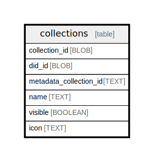

# collections

## Description

<details>
<summary><strong>Table Definition</strong></summary>

```sql
CREATE TABLE `collections` (
    `collection_id` BLOB NOT NULL PRIMARY KEY,
    `did_id` BLOB NOT NULL,
    `metadata_collection_id` TEXT NOT NULL,
    `name` TEXT,
    `visible` BOOLEAN NOT NULL,
    `icon` TEXT,
    `is_named` BOOLEAN GENERATED ALWAYS AS (`name` IS NOT NULL) STORED
)
```

</details>

## Columns

| Name | Type | Default | Nullable | Children | Parents | Comment |
| ---- | ---- | ------- | -------- | -------- | ------- | ------- |
| collection_id | BLOB |  | false |  |  |  |
| did_id | BLOB |  | false |  |  |  |
| metadata_collection_id | TEXT |  | false |  |  |  |
| name | TEXT |  | true |  |  |  |
| visible | BOOLEAN |  | false |  |  |  |
| icon | TEXT |  | true |  |  |  |

## Constraints

| Name | Type | Definition |
| ---- | ---- | ---------- |
| collection_id | PRIMARY KEY | PRIMARY KEY (collection_id) |
| sqlite_autoindex_collections_1 | PRIMARY KEY | PRIMARY KEY (collection_id) |

## Indexes

| Name | Definition |
| ---- | ---------- |
| col_name | CREATE INDEX `col_name` ON `collections` (`visible` DESC, `is_named` DESC, `name` ASC, `collection_id` ASC) |
| sqlite_autoindex_collections_1 | PRIMARY KEY (collection_id) |

## Relations



---

> Generated by [tbls](https://github.com/k1LoW/tbls)
