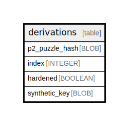

# derivations

## Description

<details>
<summary><strong>Table Definition</strong></summary>

```sql
CREATE TABLE `derivations` (
    `p2_puzzle_hash` BLOB NOT NULL PRIMARY KEY,
    `index` INTEGER NOT NULL,
    `hardened` BOOLEAN NOT NULL,
    `synthetic_key` BLOB NOT NULL
)
```

</details>

## Columns

| Name | Type | Default | Nullable | Children | Parents | Comment |
| ---- | ---- | ------- | -------- | -------- | ------- | ------- |
| p2_puzzle_hash | BLOB |  | false |  |  |  |
| index | INTEGER |  | false |  |  |  |
| hardened | BOOLEAN |  | false |  |  |  |
| synthetic_key | BLOB |  | false |  |  |  |

## Constraints

| Name | Type | Definition |
| ---- | ---- | ---------- |
| p2_puzzle_hash | PRIMARY KEY | PRIMARY KEY (p2_puzzle_hash) |
| sqlite_autoindex_derivations_1 | PRIMARY KEY | PRIMARY KEY (p2_puzzle_hash) |

## Indexes

| Name | Definition |
| ---- | ---------- |
| derivation_key | CREATE INDEX `derivation_key` ON `derivations` (`synthetic_key`) |
| derivation_index | CREATE INDEX `derivation_index` ON `derivations` (`index`, `hardened`) |
| sqlite_autoindex_derivations_1 | PRIMARY KEY (p2_puzzle_hash) |

## Relations



---

> Generated by [tbls](https://github.com/k1LoW/tbls)
