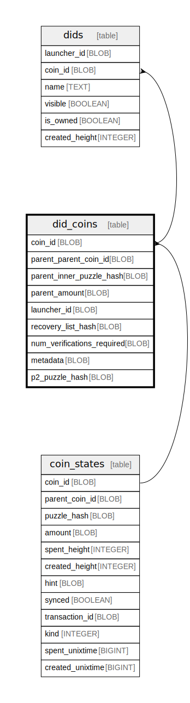

# did_coins

## Description

<details>
<summary><strong>Table Definition</strong></summary>

```sql
CREATE TABLE `did_coins` (
    `coin_id` BLOB NOT NULL PRIMARY KEY,
    `parent_parent_coin_id` BLOB NOT NULL,
    `parent_inner_puzzle_hash` BLOB NOT NULL,
    `parent_amount` BLOB NOT NULL,
    `launcher_id` BLOB NOT NULL,
    `recovery_list_hash` BLOB,
    `num_verifications_required` BLOB NOT NULL,
    `metadata` BLOB NOT NULL,
    `p2_puzzle_hash` BLOB NOT NULL,
    FOREIGN KEY (`coin_id`) REFERENCES `coin_states` (`coin_id`) ON DELETE CASCADE
)
```

</details>

## Columns

| Name | Type | Default | Nullable | Children | Parents | Comment |
| ---- | ---- | ------- | -------- | -------- | ------- | ------- |
| coin_id | BLOB |  | false | [dids](dids.md) | [coin_states](coin_states.md) |  |
| parent_parent_coin_id | BLOB |  | false |  |  |  |
| parent_inner_puzzle_hash | BLOB |  | false |  |  |  |
| parent_amount | BLOB |  | false |  |  |  |
| launcher_id | BLOB |  | false |  |  |  |
| recovery_list_hash | BLOB |  | true |  |  |  |
| num_verifications_required | BLOB |  | false |  |  |  |
| metadata | BLOB |  | false |  |  |  |
| p2_puzzle_hash | BLOB |  | false |  |  |  |

## Constraints

| Name | Type | Definition |
| ---- | ---- | ---------- |
| coin_id | PRIMARY KEY | PRIMARY KEY (coin_id) |
| - (Foreign key ID: 0) | FOREIGN KEY | FOREIGN KEY (coin_id) REFERENCES coin_states (coin_id) ON UPDATE NO ACTION ON DELETE CASCADE MATCH NONE |
| sqlite_autoindex_did_coins_1 | PRIMARY KEY | PRIMARY KEY (coin_id) |

## Indexes

| Name | Definition |
| ---- | ---------- |
| did_launcher_id | CREATE INDEX `did_launcher_id` ON `did_coins` (`launcher_id`) |
| sqlite_autoindex_did_coins_1 | PRIMARY KEY (coin_id) |

## Relations



---

> Generated by [tbls](https://github.com/k1LoW/tbls)
