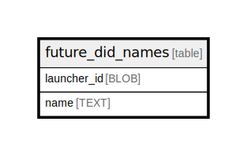

# future_did_names

## Description

<details>
<summary><strong>Table Definition</strong></summary>

```sql
CREATE TABLE `future_did_names` (
    `launcher_id` BLOB NOT NULL PRIMARY KEY,
    `name` TEXT NOT NULL
)
```

</details>

## Columns

| Name | Type | Default | Nullable | Children | Parents | Comment |
| ---- | ---- | ------- | -------- | -------- | ------- | ------- |
| launcher_id | BLOB |  | false |  |  |  |
| name | TEXT |  | false |  |  |  |

## Constraints

| Name | Type | Definition |
| ---- | ---- | ---------- |
| launcher_id | PRIMARY KEY | PRIMARY KEY (launcher_id) |
| sqlite_autoindex_future_did_names_1 | PRIMARY KEY | PRIMARY KEY (launcher_id) |

## Indexes

| Name | Definition |
| ---- | ---------- |
| sqlite_autoindex_future_did_names_1 | PRIMARY KEY (launcher_id) |

## Relations



---

> Generated by [tbls](https://github.com/k1LoW/tbls)
