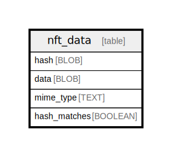

# nft_data

## Description

<details>
<summary><strong>Table Definition</strong></summary>

```sql
CREATE TABLE `nft_data` (
    `hash` BLOB NOT NULL PRIMARY KEY,
    `data` BLOB NOT NULL,
    `mime_type` TEXT NOT NULL
, `hash_matches` BOOLEAN NOT NULL DEFAULT 1)
```

</details>

## Columns

| Name | Type | Default | Nullable | Children | Parents | Comment |
| ---- | ---- | ------- | -------- | -------- | ------- | ------- |
| hash | BLOB |  | false |  |  |  |
| data | BLOB |  | false |  |  |  |
| mime_type | TEXT |  | false |  |  |  |
| hash_matches | BOOLEAN | 1 | false |  |  |  |

## Constraints

| Name | Type | Definition |
| ---- | ---- | ---------- |
| hash | PRIMARY KEY | PRIMARY KEY (hash) |
| sqlite_autoindex_nft_data_1 | PRIMARY KEY | PRIMARY KEY (hash) |

## Indexes

| Name | Definition |
| ---- | ---------- |
| sqlite_autoindex_nft_data_1 | PRIMARY KEY (hash) |

## Relations



---

> Generated by [tbls](https://github.com/k1LoW/tbls)
