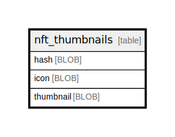

# nft_thumbnails

## Description

<details>
<summary><strong>Table Definition</strong></summary>

```sql
CREATE TABLE `nft_thumbnails` (
    `hash` BLOB NOT NULL PRIMARY KEY,
    `icon` BLOB NOT NULL,
    `thumbnail` BLOB NOT NULL
)
```

</details>

## Columns

| Name | Type | Default | Nullable | Children | Parents | Comment |
| ---- | ---- | ------- | -------- | -------- | ------- | ------- |
| hash | BLOB |  | false |  |  |  |
| icon | BLOB |  | false |  |  |  |
| thumbnail | BLOB |  | false |  |  |  |

## Constraints

| Name | Type | Definition |
| ---- | ---- | ---------- |
| hash | PRIMARY KEY | PRIMARY KEY (hash) |
| sqlite_autoindex_nft_thumbnails_1 | PRIMARY KEY | PRIMARY KEY (hash) |

## Indexes

| Name | Definition |
| ---- | ---------- |
| sqlite_autoindex_nft_thumbnails_1 | PRIMARY KEY (hash) |

## Relations



---

> Generated by [tbls](https://github.com/k1LoW/tbls)
