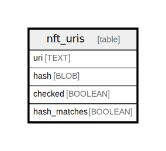

# nft_uris

## Description

<details>
<summary><strong>Table Definition</strong></summary>

```sql
CREATE TABLE `nft_uris` (
    `uri` TEXT NOT NULL,
    `hash` BLOB NOT NULL,
    `checked` BOOLEAN NOT NULL, `hash_matches` BOOLEAN,
    PRIMARY KEY (`uri`, `hash`)
)
```

</details>

## Columns

| Name | Type | Default | Nullable | Children | Parents | Comment |
| ---- | ---- | ------- | -------- | -------- | ------- | ------- |
| uri | TEXT |  | false |  |  |  |
| hash | BLOB |  | false |  |  |  |
| checked | BOOLEAN |  | false |  |  |  |
| hash_matches | BOOLEAN |  | true |  |  |  |

## Constraints

| Name | Type | Definition |
| ---- | ---- | ---------- |
| uri | PRIMARY KEY | PRIMARY KEY (uri) |
| hash | PRIMARY KEY | PRIMARY KEY (hash) |
| sqlite_autoindex_nft_uris_1 | PRIMARY KEY | PRIMARY KEY (uri, hash) |

## Indexes

| Name | Definition |
| ---- | ---------- |
| nft_uri_checked_hash | CREATE INDEX `nft_uri_checked_hash` ON `nft_uris` (`checked`, `hash`) |
| sqlite_autoindex_nft_uris_1 | PRIMARY KEY (uri, hash) |

## Relations



---

> Generated by [tbls](https://github.com/k1LoW/tbls)
