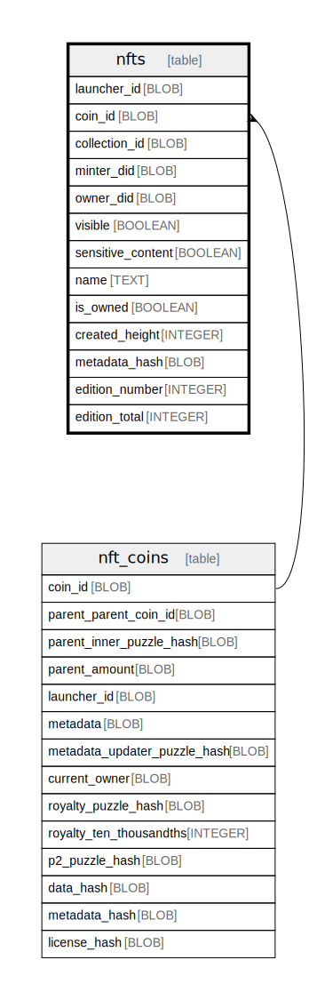

# nfts

## Description

<details>
<summary><strong>Table Definition</strong></summary>

```sql
CREATE TABLE `nfts` (
    `launcher_id` BLOB NOT NULL PRIMARY KEY,
    `coin_id` BLOB NOT NULL,
    `collection_id` BLOB,
    `minter_did` BLOB,
    `owner_did` BLOB,
    `visible` BOOLEAN NOT NULL,
    `sensitive_content` BOOLEAN NOT NULL,
    `name` TEXT,
    `is_owned` BOOLEAN NOT NULL,
    `is_named` BOOLEAN GENERATED ALWAYS AS (`name` IS NOT NULL) STORED,
    `created_height` INTEGER,
    `is_pending` BOOLEAN GENERATED ALWAYS AS (`created_height` IS NULL) STORED,
    `metadata_hash` BLOB, `edition_number` INTEGER, `edition_total` INTEGER,
    FOREIGN KEY (`coin_id`) REFERENCES `nft_coins` (`coin_id`) ON DELETE CASCADE
)
```

</details>

## Columns

| Name | Type | Default | Nullable | Children | Parents | Comment |
| ---- | ---- | ------- | -------- | -------- | ------- | ------- |
| launcher_id | BLOB |  | false |  |  |  |
| coin_id | BLOB |  | false |  | [nft_coins](nft_coins.md) |  |
| collection_id | BLOB |  | true |  |  |  |
| minter_did | BLOB |  | true |  |  |  |
| owner_did | BLOB |  | true |  |  |  |
| visible | BOOLEAN |  | false |  |  |  |
| sensitive_content | BOOLEAN |  | false |  |  |  |
| name | TEXT |  | true |  |  |  |
| is_owned | BOOLEAN |  | false |  |  |  |
| created_height | INTEGER |  | true |  |  |  |
| metadata_hash | BLOB |  | true |  |  |  |
| edition_number | INTEGER |  | true |  |  |  |
| edition_total | INTEGER |  | true |  |  |  |

## Constraints

| Name | Type | Definition |
| ---- | ---- | ---------- |
| launcher_id | PRIMARY KEY | PRIMARY KEY (launcher_id) |
| - (Foreign key ID: 0) | FOREIGN KEY | FOREIGN KEY (coin_id) REFERENCES nft_coins (coin_id) ON UPDATE NO ACTION ON DELETE CASCADE MATCH NONE |
| sqlite_autoindex_nfts_1 | PRIMARY KEY | PRIMARY KEY (launcher_id) |

## Indexes

| Name | Definition |
| ---- | ---------- |
| nft_owner_did_name | CREATE INDEX `nft_owner_did_name` ON `nfts` (<br>    `is_owned`,<br>    `owner_did`,<br>    `visible` DESC,<br>    `is_pending` DESC,<br>    `is_named` DESC,<br>    `name` ASC,<br>    `edition_number` ASC,<br>    `launcher_id` ASC<br>) |
| nft_minter_did_name | CREATE INDEX `nft_minter_did_name` ON `nfts` (<br>    `is_owned`,<br>    `minter_did`,<br>    `visible` DESC,<br>    `is_pending` DESC,<br>    `is_named` DESC,<br>    `name` ASC,<br>    `edition_number` ASC,<br>    `launcher_id` ASC<br>) |
| nft_col_name | CREATE INDEX `nft_col_name` ON `nfts` (`is_owned`, `collection_id`, `visible` DESC, `is_pending` DESC, `is_named` DESC, `name` ASC, `edition_number` ASC, `launcher_id` ASC) |
| nft_name | CREATE INDEX `nft_name` ON `nfts` (`is_owned`, `visible` DESC, `is_pending` DESC, `is_named` DESC, `name` ASC, `edition_number` ASC, `launcher_id` ASC) |
| nft_owner_did_recent | CREATE INDEX `nft_owner_did_recent` ON `nfts` (<br>    `is_owned`, <br>    `owner_did`,<br>    `visible` DESC,<br>    `is_pending` DESC,<br>    `created_height` DESC,<br>    `launcher_id` ASC<br>) |
| nft_minter_did_recent | CREATE INDEX `nft_minter_did_recent` ON `nfts` (<br>    `is_owned`, <br>    `minter_did`,<br>    `visible` DESC,<br>    `is_pending` DESC,<br>    `created_height` DESC,<br>    `launcher_id` ASC<br>) |
| nft_col_recent | CREATE INDEX `nft_col_recent` ON `nfts` (`is_owned`, `collection_id`, `visible` DESC, `is_pending` DESC, `created_height` DESC, `launcher_id` ASC) |
| nft_recent | CREATE INDEX `nft_recent` ON `nfts` (`is_owned`, `visible` DESC, `is_pending` DESC, `created_height` DESC, `launcher_id` ASC) |
| nft_metadata | CREATE INDEX `nft_metadata` ON `nfts` (`is_owned`, `metadata_hash`) |
| nft_coin_id | CREATE INDEX `nft_coin_id` ON `nfts` (`coin_id`) |
| sqlite_autoindex_nfts_1 | PRIMARY KEY (launcher_id) |

## Relations



---

> Generated by [tbls](https://github.com/k1LoW/tbls)
