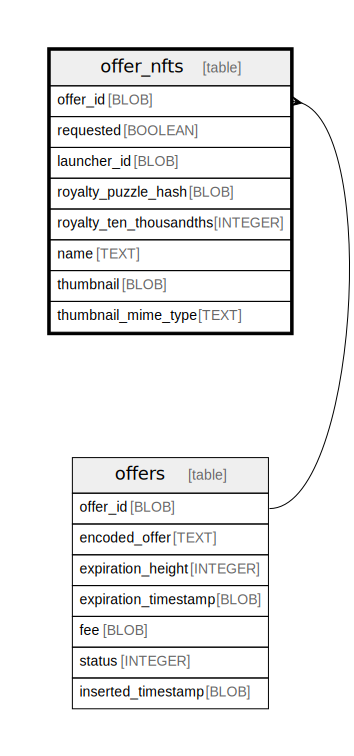

# offer_nfts

## Description

<details>
<summary><strong>Table Definition</strong></summary>

```sql
CREATE TABLE "offer_nfts" (
    `offer_id` BLOB NOT NULL,
    `requested` BOOLEAN NOT NULL,
    `launcher_id` BLOB NOT NULL,
    `royalty_puzzle_hash` BLOB NOT NULL,
    `royalty_ten_thousandths` INTEGER NOT NULL,
    `name` TEXT,
    `thumbnail` BLOB,
    `thumbnail_mime_type` TEXT,
    PRIMARY KEY (`offer_id`, `launcher_id`, `requested`),
    FOREIGN KEY (`offer_id`) REFERENCES `offers`(`offer_id`) ON DELETE CASCADE
)
```

</details>

## Columns

| Name | Type | Default | Nullable | Children | Parents | Comment |
| ---- | ---- | ------- | -------- | -------- | ------- | ------- |
| offer_id | BLOB |  | false |  | [offers](offers.md) |  |
| requested | BOOLEAN |  | false |  |  |  |
| launcher_id | BLOB |  | false |  |  |  |
| royalty_puzzle_hash | BLOB |  | false |  |  |  |
| royalty_ten_thousandths | INTEGER |  | false |  |  |  |
| name | TEXT |  | true |  |  |  |
| thumbnail | BLOB |  | true |  |  |  |
| thumbnail_mime_type | TEXT |  | true |  |  |  |

## Constraints

| Name | Type | Definition |
| ---- | ---- | ---------- |
| offer_id | PRIMARY KEY | PRIMARY KEY (offer_id) |
| requested | PRIMARY KEY | PRIMARY KEY (requested) |
| launcher_id | PRIMARY KEY | PRIMARY KEY (launcher_id) |
| - (Foreign key ID: 0) | FOREIGN KEY | FOREIGN KEY (offer_id) REFERENCES offers (offer_id) ON UPDATE NO ACTION ON DELETE CASCADE MATCH NONE |
| sqlite_autoindex_offer_nfts_1 | PRIMARY KEY | PRIMARY KEY (offer_id, launcher_id, requested) |

## Indexes

| Name | Definition |
| ---- | ---------- |
| nft_offer_id | CREATE INDEX `nft_offer_id` ON `offer_nfts` (`offer_id`) |
| sqlite_autoindex_offer_nfts_1 | PRIMARY KEY (offer_id, launcher_id, requested) |

## Relations



---

> Generated by [tbls](https://github.com/k1LoW/tbls)
