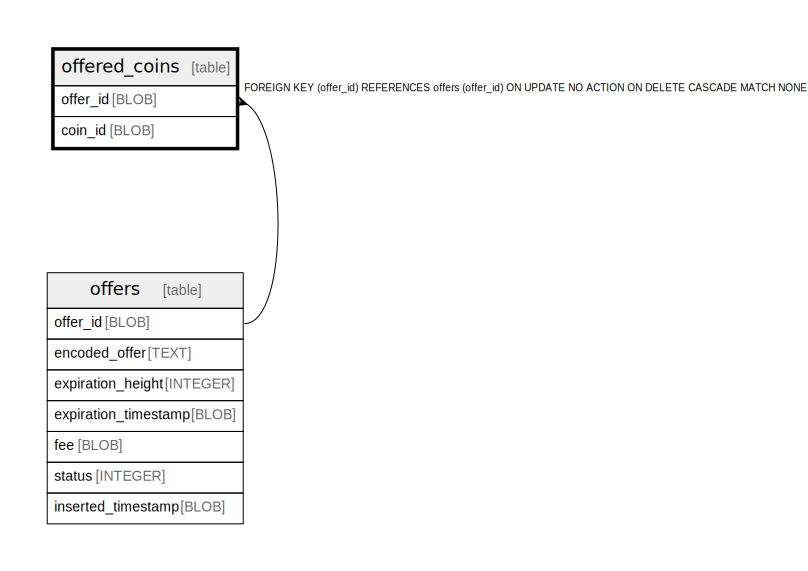

# offered_coins

## Description

<details>
<summary><strong>Table Definition</strong></summary>

```sql
CREATE TABLE `offered_coins` (
    `offer_id` BLOB NOT NULL,
    `coin_id` BLOB NOT NULL,
    PRIMARY KEY (`offer_id`, `coin_id`),
    FOREIGN KEY (`offer_id`) REFERENCES `offers`(`offer_id`) ON DELETE CASCADE
)
```

</details>

## Columns

| Name | Type | Default | Nullable | Children | Parents | Comment |
| ---- | ---- | ------- | -------- | -------- | ------- | ------- |
| offer_id | BLOB |  | false |  | [offers](offers.md) |  |
| coin_id | BLOB |  | false |  |  |  |

## Constraints

| Name | Type | Definition |
| ---- | ---- | ---------- |
| offer_id | PRIMARY KEY | PRIMARY KEY (offer_id) |
| coin_id | PRIMARY KEY | PRIMARY KEY (coin_id) |
| - (Foreign key ID: 0) | FOREIGN KEY | FOREIGN KEY (offer_id) REFERENCES offers (offer_id) ON UPDATE NO ACTION ON DELETE CASCADE MATCH NONE |
| sqlite_autoindex_offered_coins_1 | PRIMARY KEY | PRIMARY KEY (offer_id, coin_id) |

## Indexes

| Name | Definition |
| ---- | ---------- |
| offer_coin_id | CREATE INDEX `offer_coin_id` ON `offered_coins` (`coin_id`) |
| sqlite_autoindex_offered_coins_1 | PRIMARY KEY (offer_id, coin_id) |

## Relations



---

> Generated by [tbls](https://github.com/k1LoW/tbls)
