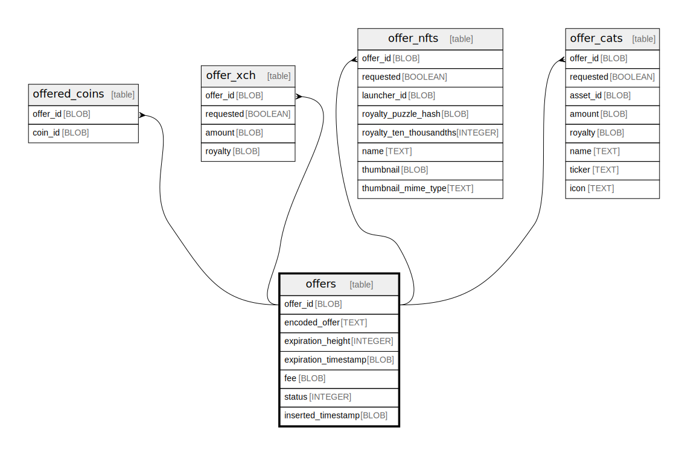

# offers

## Description

<details>
<summary><strong>Table Definition</strong></summary>

```sql
CREATE TABLE `offers` (
    `offer_id` BLOB NOT NULL PRIMARY KEY,
    `encoded_offer` TEXT NOT NULL,
    `expiration_height` INTEGER,
    `expiration_timestamp` BLOB,
    `fee` BLOB NOT NULL,
    `status` INTEGER NOT NULL,
    `inserted_timestamp` BLOB NOT NULL
)
```

</details>

## Columns

| Name | Type | Default | Nullable | Children | Parents | Comment |
| ---- | ---- | ------- | -------- | -------- | ------- | ------- |
| offer_id | BLOB |  | false | [offered_coins](offered_coins.md) [offer_xch](offer_xch.md) [offer_nfts](offer_nfts.md) [offer_cats](offer_cats.md) |  |  |
| encoded_offer | TEXT |  | false |  |  |  |
| expiration_height | INTEGER |  | true |  |  |  |
| expiration_timestamp | BLOB |  | true |  |  |  |
| fee | BLOB |  | false |  |  |  |
| status | INTEGER |  | false |  |  |  |
| inserted_timestamp | BLOB |  | false |  |  |  |

## Constraints

| Name | Type | Definition |
| ---- | ---- | ---------- |
| offer_id | PRIMARY KEY | PRIMARY KEY (offer_id) |
| sqlite_autoindex_offers_1 | PRIMARY KEY | PRIMARY KEY (offer_id) |

## Indexes

| Name | Definition |
| ---- | ---------- |
| offer_timestamp | CREATE INDEX `offer_timestamp` ON `offers` (`inserted_timestamp` DESC) |
| offer_status | CREATE INDEX `offer_status` ON `offers` (`status`) |
| sqlite_autoindex_offers_1 | PRIMARY KEY (offer_id) |

## Relations



---

> Generated by [tbls](https://github.com/k1LoW/tbls)
