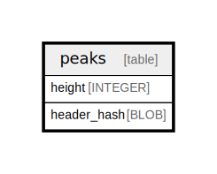

# peaks

## Description

<details>
<summary><strong>Table Definition</strong></summary>

```sql
CREATE TABLE `peaks` (
    `height` INTEGER NOT NULL PRIMARY KEY,
    `header_hash` BLOB NOT NULL
)
```

</details>

## Columns

| Name | Type | Default | Nullable | Children | Parents | Comment |
| ---- | ---- | ------- | -------- | -------- | ------- | ------- |
| height | INTEGER |  | false |  |  |  |
| header_hash | BLOB |  | false |  |  |  |

## Constraints

| Name | Type | Definition |
| ---- | ---- | ---------- |
| height | PRIMARY KEY | PRIMARY KEY (height) |

## Relations



---

> Generated by [tbls](https://github.com/k1LoW/tbls)
