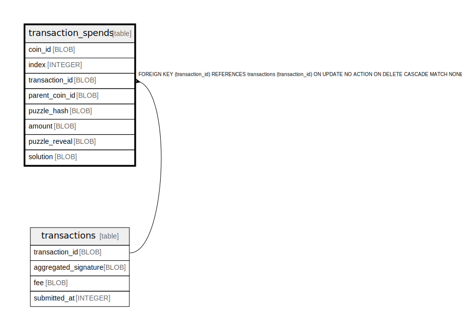

# transaction_spends

## Description

<details>
<summary><strong>Table Definition</strong></summary>

```sql
CREATE TABLE `transaction_spends` (
    `coin_id` BLOB NOT NULL PRIMARY KEY,
    `index` INTEGER NOT NULL,
    `transaction_id` BLOB NOT NULL,
    `parent_coin_id` BLOB NOT NULL,
    `puzzle_hash` BLOB NOT NULL,
    `amount` BLOB NOT NULL,
    `puzzle_reveal` BLOB NOT NULL,
    `solution` BLOB NOT NULL,
    FOREIGN KEY (`transaction_id`) REFERENCES `transactions` (`transaction_id`) ON DELETE CASCADE
)
```

</details>

## Columns

| Name | Type | Default | Nullable | Children | Parents | Comment |
| ---- | ---- | ------- | -------- | -------- | ------- | ------- |
| coin_id | BLOB |  | false |  |  |  |
| index | INTEGER |  | false |  |  |  |
| transaction_id | BLOB |  | false |  | [transactions](transactions.md) |  |
| parent_coin_id | BLOB |  | false |  |  |  |
| puzzle_hash | BLOB |  | false |  |  |  |
| amount | BLOB |  | false |  |  |  |
| puzzle_reveal | BLOB |  | false |  |  |  |
| solution | BLOB |  | false |  |  |  |

## Constraints

| Name | Type | Definition |
| ---- | ---- | ---------- |
| coin_id | PRIMARY KEY | PRIMARY KEY (coin_id) |
| - (Foreign key ID: 0) | FOREIGN KEY | FOREIGN KEY (transaction_id) REFERENCES transactions (transaction_id) ON UPDATE NO ACTION ON DELETE CASCADE MATCH NONE |
| sqlite_autoindex_transaction_spends_1 | PRIMARY KEY | PRIMARY KEY (coin_id) |

## Indexes

| Name | Definition |
| ---- | ---------- |
| indexed_spend | CREATE INDEX `indexed_spend` ON `transaction_spends` (`transaction_id`, `index` ASC) |
| sqlite_autoindex_transaction_spends_1 | PRIMARY KEY (coin_id) |

## Relations



---

> Generated by [tbls](https://github.com/k1LoW/tbls)
