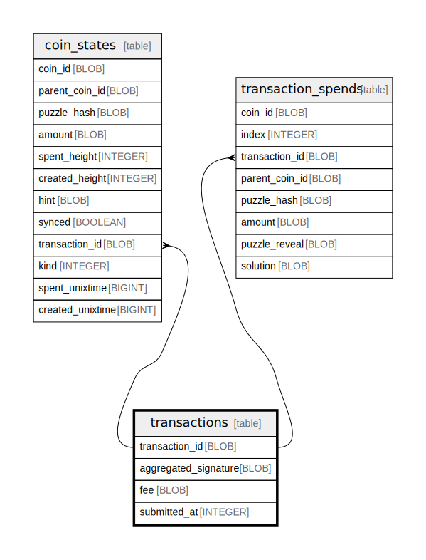

# transactions

## Description

<details>
<summary><strong>Table Definition</strong></summary>

```sql
CREATE TABLE `transactions` (
    `transaction_id` BLOB NOT NULL PRIMARY KEY,
    `aggregated_signature` BLOB NOT NULL,
    `fee` BLOB NOT NULL,
    `submitted_at` INTEGER
)
```

</details>

## Columns

| Name | Type | Default | Nullable | Children | Parents | Comment |
| ---- | ---- | ------- | -------- | -------- | ------- | ------- |
| transaction_id | BLOB |  | false | [coin_states](coin_states.md) [transaction_spends](transaction_spends.md) |  |  |
| aggregated_signature | BLOB |  | false |  |  |  |
| fee | BLOB |  | false |  |  |  |
| submitted_at | INTEGER |  | true |  |  |  |

## Constraints

| Name | Type | Definition |
| ---- | ---- | ---------- |
| transaction_id | PRIMARY KEY | PRIMARY KEY (transaction_id) |
| sqlite_autoindex_transactions_1 | PRIMARY KEY | PRIMARY KEY (transaction_id) |

## Indexes

| Name | Definition |
| ---- | ---------- |
| sqlite_autoindex_transactions_1 | PRIMARY KEY (transaction_id) |

## Relations



---

> Generated by [tbls](https://github.com/k1LoW/tbls)
